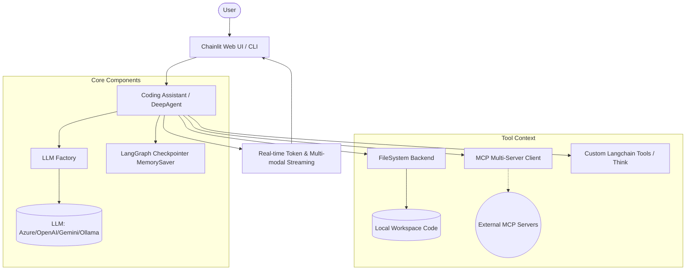

# AI Intern Architecture

## Overview
AI Intern is a robust, agentic AI coding assistant designed to help developers explore, modify, and build software locally. It leverages the [deepagents](https://github.com/langchain-ai/deepagents) framework atop LangGraph to plan and execute tasks with a set of integrated tools spanning file operations, shell execution, and external tool protocols (MCP).

## Capabilities
- **Autonomous Planning**: Through `write_todos` and LangGraph checkpointing, the agent maintains an up-to-date plan of action in a structured task list visible in the web UI.
- **Multi-Provider LLM Access**: Abstracted via `llm_factory.py`, seamlessly switch between Azure OpenAI, standard OpenAI, Google Gemini, and local Ollama models.
- **Filesystem & Shell Mastery**: Uses `LocalShellBackend` to safely construct a virtual workspace environment. Capable of exploration (`ls`, `find_by_name`), file manipulation (`read_file`, `write_file`, `edit_file`), full-text search (`grep_search`), and executing terminal commands (`execute`).
- **Model Context Protocol (MCP)**: Native integration via `langchain_mcp_adapters` allows the agent to connect automatically to standardized external APIs and context servers (e.g., Microsoft Docs MCP Server) and invoke them seamlessly as built-in tools.
- **Custom Extensibility**: The system is designed for arbitrary custom tool injection (via `tools.py`). Currently, it features a custom `think` tool which lets the agent isolate complex reasoning chains before acting on code.
- **Interactive, Context-Rich UI**: Powered by Chainlit. It interprets `on_tool_start` and `on_tool_end` streaming events to present dynamic status bars ("Thinking...", "Editing...", "Listing..."). It overlays clean, intuitive visual components over raw tool execution output (such as Custom Diff Viewer and Terminal Output blocks) while tracking persistent thread status via LangGraph's checkpointer.

## Architecture Diagram

## How It Works (The Agent Loop)
1. **User Request**: The user submits a prompt, which can optionally include attached images/documents.
2. **Setup**: The backend (`assistant_ui.py`) initiates the execution stream, fetching memory state for the current `thread_id`.
3. **Context Gathering**: The agent uses shell commands, globbing, or grep to read necessary files and understand the current code state.
4. **Planning**: The agent uses the `write_todos` tool. The output is intercepted by the UI and rendered in a live Markdown task sidebar.
5. **Execution & Reasoning**: 
    - The agent isolates tricky problems using the `think` tool.
    - It invokes external APIs using MCP tools fetched during initialization.
    - It modifies code with `edit_file`.
6. **UI Component Rendering**: The Chainlit layer catches tool arguments to display visual cues. When `edit_file` finishes executing, a diff viewer is instantiated. When `execute` runs a bash command, a styled terminal output element pops up.
7. **Consolidated Output**: The loop repeats until its goal is achieved, finishing with a chat summary streamed back to the user.

## Use Cases
- **Legacy Code Exploration**: Open an unfamiliar, undocumented repository in the agent. Request an architecture map and file inventory; the agent uses `find_by_name`, `read_file`, and generates an exploratory document mapping the structure.
- **Automated Complex Refactoring**: Instruct the agent to move and rewrite deprecated interfaces. It updates its task list, sweeps the project with `grep_search`, modifies each file iteratively using `edit_file`, and you visually audit the transformations live through UI DiffViewers.
- **Bug Fixing via Feedback Loop**: Feed an error stack-trace. The agent `read`s the failing module, writes a test covering the behavior (using `write_file`), executes test cases live via `execute`, catches the command outcome, analyzes the result via `think`, and pushes patches until the exit code equals 0.
- **Contextual Upgrades**: Tell the agent to implement an obscure API properly. Through `mcp_client.py`, it can transparently query the Docs Provider's MCP node to retrieve exact, up-to-date specs, bypassing the LLM's inherently outdated internal knowledge cutoffs.
- **Seamless Prompt Engineering**: Verify your setup locally utilizing an Ollama model, and hot-swap to Azure or Google Gemini when executing heavy, complex lifting, all under the same workspace environment and UX wrapper.
