# AI Intern Architecture

## Overview
AI Intern is a robust, agentic AI coding assistant designed to help developers explore, modify, and build software locally. It leverages the [deepagents](https://github.com/langchain-ai/deepagents) framework atop LangGraph to plan and execute tasks with a set of integrated tools spanning file operations, shell execution, browser interaction, Git version control, and external tool protocols (MCP).

## Project Layout

```
ai-intern/
├── app.py                   # Production entry point (Chat + Dashboard combined)
├── assistant_ui.py          # Chainlit web UI — streaming, tool rendering, auth
├── assistant_cli.py         # Lightweight CLI interface
├── init_db.py               # One-time DB schema setup
│
├── core/                    # Agent brain
│   ├── coding_assistant.py  # DeepAgent setup, system prompt, tool wiring
│   ├── llm_factory.py       # Multi-provider LLM initialization
│   └── mcp_client.py        # MCP server configuration & tool loading
│
├── tools/                   # All LangChain tools
│   ├── custom_tools.py      # think, read_package_source
│   ├── browser_tools.py     # Playwright browser tools
│   ├── git_tools.py         # Git tools (GitPython)
│   └── vector_search.py     # Semantic code search (ChromaDB + embeddings)
│
├── dashboard/               # Admin dashboard
│   ├── api.py               # FastAPI routes
│   ├── db.py                # SQLite helpers
│   └── static/              # Dashboard frontend
│
├── public/elements/         # Chainlit custom UI elements (DiffViewer, TerminalOutput)
└── agent_data/              # Runtime databases
```

## Capabilities
- **Autonomous Planning**: Through `write_todos` and LangGraph checkpointing, the agent maintains an up-to-date plan of action in a structured task list visible in the web UI.
- **Multi-Provider LLM Access**: Abstracted via `llm_factory.py`, seamlessly switch between Azure OpenAI, standard OpenAI, Google Gemini, and local Ollama models. Supports `use_responses_api=True` for models that require the OpenAI Responses API (e.g. `codex-mini-latest`, `o3`, `o4-mini`).
- **Agent Middleware**: Five middleware layers run automatically — `SummarizationMiddleware` (auto-compresses context when token count exceeds `SUMMARIZATION_TOKEN_TRIGGER`), `PIIMiddleware` (redacts emails, credit cards, passwords, API keys/tokens from code), `ModelRetryMiddleware` (retries LLM rate limits/503s), and `ToolRetryMiddleware` (retries transient tool failures).
- **Tool Management**: All tools are registered in `all_known_tools` in the dashboard DB on every startup. The dashboard shows the full list regardless of enabled state. New tools added to the codebase are auto-discovered and added as enabled. Disabling a tool removes it from the active agent tool list without losing it from the dashboard view.
- **Prompt Debug Logging**: `PromptDebugCallback` in `llm_factory.py` prints the full prompt (per block with char counts and token estimates) when `DEBUG_PRINT_PROMPT=true`. Helps identify token waste from system prompt, repo map, or conversation history.
- **Filesystem & Shell Mastery**: Uses `LocalShellBackend` to safely construct a virtual workspace environment. Capable of exploration (`ls`, `find_by_name`), file manipulation (`read_file`, `write_file`, `edit_file`), full-text search (`grep_search`), and executing terminal commands (`execute`).
- **Semantic Code Search**: Via `tools/vector_search.py`, the agent can search the codebase by meaning using ChromaDB and local embeddings. Answers queries like "Where is the authentication logic?" by returning the most relevant code chunks. Index is persisted in `agent_data/chroma/` and rebuilt on demand.
- **Browser Interaction**: Via `tools/browser_tools.py`, the agent can drive a headless Microsoft Edge browser (Playwright) to take screenshots, capture JS console logs, read the DOM, click elements, and detect failed network requests — enabling autonomous frontend verification without human DevTools intervention.
- **Git Version Control**: Via `tools/git_tools.py`, the agent has full Git awareness — it can clone a repo from any remote URL, read diffs and history, commit its own work with AI-generated messages, branch safely before risky changes, push/pull to remotes, stash work, and inspect blame.
- **Model Context Protocol (MCP)**: Native integration via `core/mcp_client.py` allows the agent to connect automatically to standardized external APIs and context servers (e.g., Microsoft Docs MCP Server) and invoke them seamlessly as built-in tools.
- **Custom Extensibility**: The system is designed for arbitrary custom tool injection (via `tools/custom_tools.py`). Currently features a `think` tool for isolated reasoning chains and `read_package_source` for inspecting installed Python package internals.
- **Interactive, Context-Rich UI**: Powered by Chainlit. It interprets `on_tool_start` and `on_tool_end` streaming events to present dynamic status bars ("Thinking...", "Editing...", "📸 Screenshotting...", "💾 Committing..."). It overlays clean visual components over raw tool output — Diff Viewer, Terminal Output, and inline screenshots.
- **Admin Dashboard & Observability**: Includes a dedicated FastAPI-based dashboard for real-time monitoring. It tracks LLM token usage, tool performance, and lines of code (LOC) changes, while providing an interface to dynamically update agent settings (system prompts, iteration limits).

---

## Architecture Diagram

```mermaid
graph TD
    User([User]) --> UI[Chainlit Web UI / CLI]
    User --> Dash[Admin Dashboard]
    UI --> Assistant[Coding Assistant / DeepAgent]
    Dash --> DashAPI[Dashboard API / app.py]

    subgraph Core Components
        Assistant --> llm_factory[LLM Factory + PromptDebugCallback]
        llm_factory --> Model[(LLM: Azure/OpenAI/Gemini/Ollama)]
        Assistant --> memory_saver[LangGraph Checkpointer MemorySaver]
        Assistant --> telemetry[Telemetry Recorder]
        Assistant --> middleware[Middleware Stack]
        middleware --> summarization[SummarizationMiddleware]
        middleware --> pii[PIIMiddleware x4]
        middleware --> retries[ModelRetry + ToolRetry]
    end

    subgraph Persistence
        memory_saver --> lg_db[(checkpoints_lg.db)]
        telemetry --> dash_db[(dashboard.db)]
        UI -.-> ui_db[(chainlit_ui.db)]
    end

    subgraph Tool Context
        Assistant --> fs_tools[FileSystem Backend]
        fs_tools --> local_files[(Local Workspace Code)]

        Assistant --> browser_tools[Browser Tools / Playwright]
        browser_tools --> edge[MS Edge Headless]

        Assistant --> git_tools[Git Tools / GitPython]
        git_tools --> local_repo[(Local Git Repo)]
        git_tools --> remote_repo((Remote Git / GitHub / GitLab))

        Assistant --> mcp[MCP Multi-Server Client]
        mcp -.-> mcp_servers((External MCP Servers))

        Assistant --> custom_tools[Custom Tools / think / read_package_source]

        Assistant --> vector_search[Vector Search / ChromaDB]
        vector_search --> chroma_db[(agent_data/chroma/)]
    end

    DashAPI --> dash_db
    Assistant --> UI_streaming[Real-time Token & Multi-modal Streaming]
    UI_streaming --> UI
```



---

## Tool Inventory

### Filesystem & Shell (via `deepagents` LocalShellBackend)
| Tool | Description |
|------|-------------|
| `ls` | List directory contents |
| `find_by_name` | Find files by name pattern |
| `read_file` | Read file contents |
| `write_file` | Create a new file |
| `edit_file` | Modify an existing file (search/replace) |
| `grep_search` | Full-text search across the workspace |
| `execute` | Run arbitrary shell commands |
| `write_todos` | Update the agent's task plan (rendered in UI sidebar) |

### Custom Tools (`tools/custom_tools.py`)
| Tool | Description |
|------|-------------|
| `think` | Isolated reasoning chain — no side effects, returns a thought |
| `read_package_source` | Reads source code of any installed Python package module or class |

### Browser Tools (`tools/browser_tools.py`) — Playwright + MS Edge
| Tool | Description |
|------|-------------|
| `browser_screenshot` | Navigate to a URL and return an inline PNG screenshot |
| `browser_get_console_logs` | Capture JS console output (errors, warnings, logs) during page load |
| `browser_get_dom` | Return `outerHTML` of a CSS selector or full `body.innerHTML` |
| `browser_click_and_screenshot` | Click an element and screenshot the resulting state |
| `browser_get_network_errors` | List all HTTP 4xx/5xx and failed network requests |

All browser tools default to `allow_external=True` (any URL). Set `allow_external=False` to restrict to localhost only.

### Git Tools (`tools/git_tools.py`) — GitPython
| Tool | Type | Description |
|------|------|-------------|
| `git_clone` | Write | Clone a remote repo URL into the workspace |
| `git_status` | Read | Show staged, modified, and untracked files |
| `git_diff` | Read | Unified diff of working tree or staged changes |
| `git_log` | Read | Recent commit history as structured JSON |
| `git_blame` | Read | Line-by-line authorship for a file |
| `git_commit` | Write | Stage files and create a commit |
| `git_create_branch` | Write | Create and check out a new branch |
| `git_checkout` | Write | Switch branch or restore a file to HEAD |
| `git_push` | Write | Push to remote (never force-pushes) |
| `git_pull` | Write | Pull latest from remote |
| `git_stash` | Write | Stash or restore uncommitted changes |
| `git_generate_commit_message` | AI | Read staged diff and generate a conventional-commits message |

Write tools (`git_commit`, `git_push`, `git_pull`, `git_checkout`) trigger the human-in-the-loop approval interrupt in the Chainlit UI before executing.

### Semantic Code Search (`tools/vector_search.py`) — ChromaDB
| Tool | Description |
|------|-------------|
| `semantic_code_search` | Find relevant code chunks by natural language query (e.g. "Where is the auth logic?") |
| `rebuild_code_index` | Force a full re-index of the workspace after large refactors |

Index is persisted in `agent_data/chroma/`. Embedding backends: Ollama `nomic-embed-text` (local, no API key) → OpenAI `text-embedding-3-small` (fallback).

### MCP Tools (`core/mcp_client.py`)
Dynamically loaded at startup from configured MCP servers (e.g., Microsoft Docs, Tavily search). Registered alongside all other tools in the agent's tool list.

---

## How It Works (The Agent Loop)

1. **User Request**: The user submits a prompt (optionally with attached images/documents or a remote repo URL).
2. **Setup**: `assistant_ui.py` initiates the execution stream, fetching memory state for the current `thread_id`.
3. **Context Gathering**: The agent uses shell commands, `grep`, or Git tools to read files and understand the current code and repo state.
4. **Planning**: The agent calls `write_todos`. The output is intercepted by the UI and rendered in a live task sidebar.
5. **Execution & Reasoning**:
    - Tricky problems are isolated using `think`.
    - External APIs are queried via MCP tools.
    - Code is modified with `edit_file`.
    - Frontend changes are verified with `browser_screenshot` and `browser_get_console_logs`.
    - Git state is managed with `git_diff`, `git_commit`, `git_push`, etc.
6. **UI Component Rendering**: The Chainlit layer catches tool events to display visual cues:
    - `edit_file` / `write_file` → inline **DiffViewer**
    - `execute` → styled **TerminalOutput**
    - `browser_screenshot` / `browser_click_and_screenshot` → inline **screenshot image**
    - `browser_get_console_logs`, `git_log`, `git_status`, `git_diff` → **TerminalOutput** or **DiffViewer**
7. **Approval Gates**: Destructive tools (`execute`, `git_commit`, `git_push`, `git_pull`, `git_checkout`) pause the loop and present an Approve / Reject prompt to the user before proceeding.
8. **Consolidated Output**: The loop repeats until the goal is achieved, finishing with a streamed chat summary.

---

## Safe Experimentation Mode (Git)

Before making large-scale or destructive changes, the agent follows this pattern automatically:

```
git_status → git_create_branch (ai-intern/<task>) → edit_file (changes)
           → git_generate_commit_message → git_commit → git_push
```

If the result is unwanted, the branch can be deleted with no impact on `main`.

---

## Frontend Self-Healing Loop (Browser)

After editing frontend code, the agent can verify and fix its own work:

```
edit_file → execute (npm run dev) → browser_screenshot
          → browser_get_console_logs → [errors found] → think → edit_file → ...
```

---

## Use Cases

- **Clone & Explore a Remote Repo**: Share a GitHub URL. The agent calls `git_clone`, maps the structure with `ls` and `grep`, and generates an architecture overview — no manual setup needed.
- **Legacy Code Exploration**: Open an unfamiliar local repository. The agent uses `find_by_name`, `read_file`, and the repo map to generate an exploratory document mapping the structure.
- **Automated Complex Refactoring**: Instruct the agent to move and rewrite deprecated interfaces. It updates its task list, sweeps the project with `grep_search`, modifies each file iteratively using `edit_file`, audits changes live through DiffViewers, then commits and pushes the result.
- **Bug Fixing via Feedback Loop**: Feed an error stack-trace. The agent reads the failing module, writes a test, executes it via `execute`, analyzes the result with `think`, and patches until the exit code is 0.
- **Frontend Verification**: After editing a React component, the agent starts the dev server, takes a screenshot, checks console errors, and iterates until the UI renders correctly — all without leaving the chat.
- **Contextual Upgrades**: Tell the agent to implement an obscure API. Through `mcp_client.py`, it queries the Docs Provider's MCP node for exact, up-to-date specs, bypassing the LLM's knowledge cutoff.
- **Seamless Prompt Engineering**: Verify locally with Ollama, then hot-swap to Azure or Gemini for heavy lifting — same workspace, same UX.
